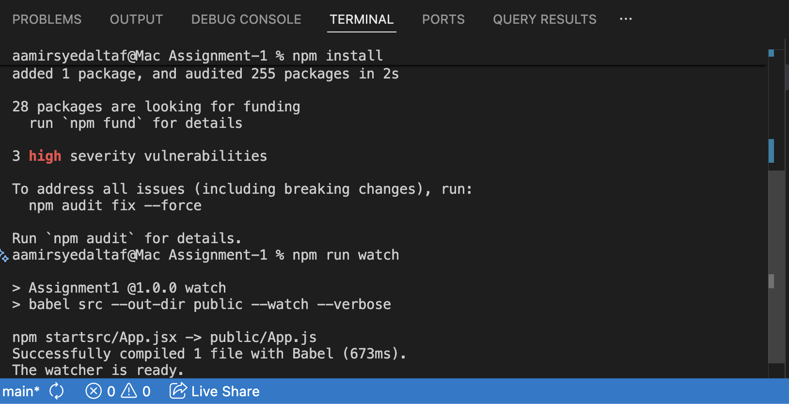
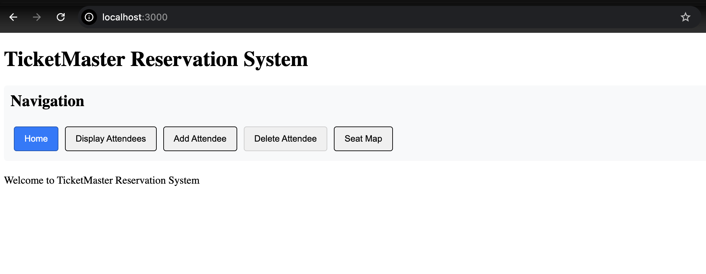
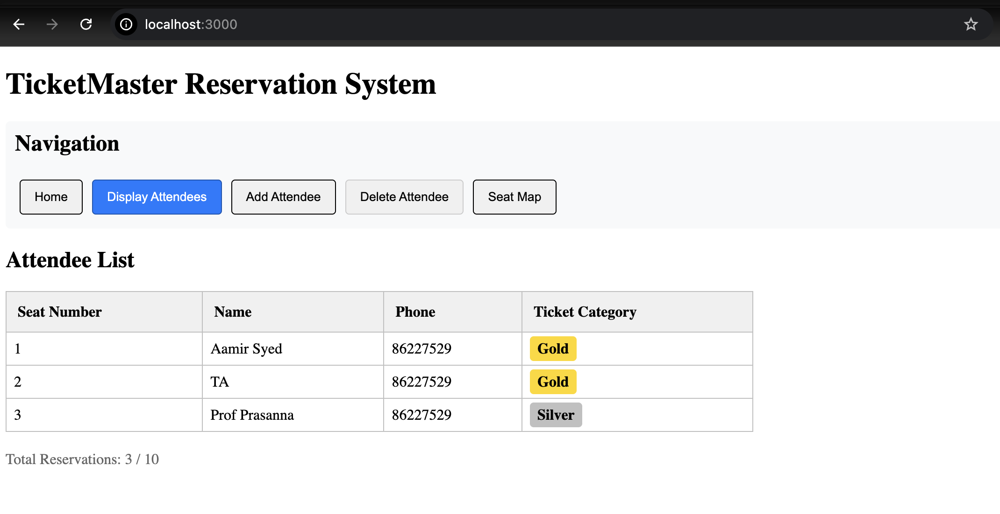
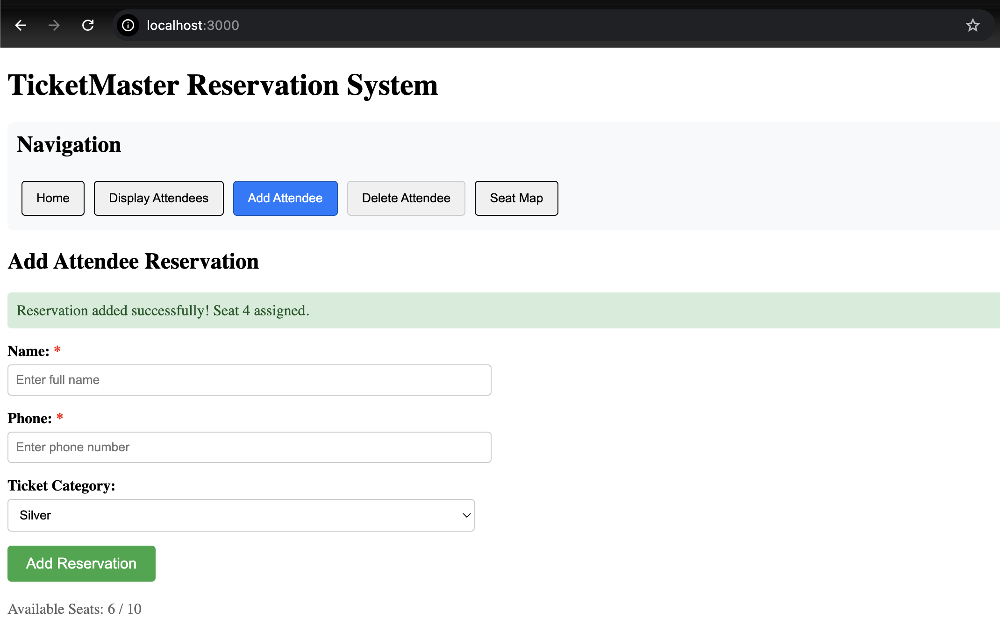
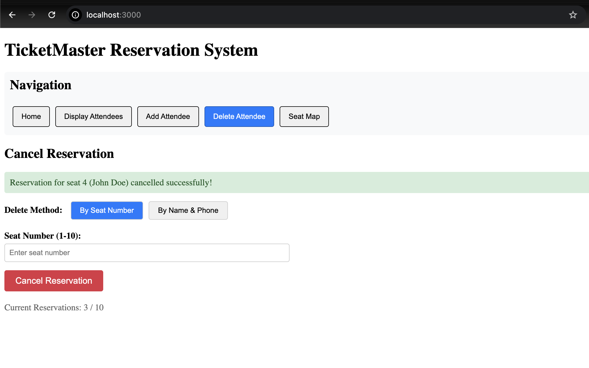
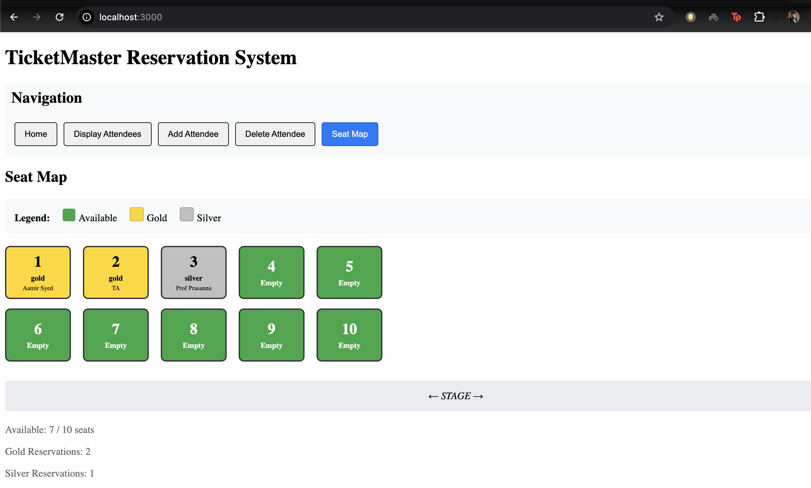

# IT5007 Assignment 1 : Single Page Application (SPA)

TicketMaster is a restaurant seating reservation system that manages up to 10 seat reservations with Gold/Silver ticket categories.

**Setup & Running**

```bash
# Install dependencies
npm install

# Compile JSX to JS (with watch mode for development)
npm run watch

# Start the server
npm start
```

Application runs at: `http://localhost:3000`

---

## Question-wise Verification Guide

### Q1: Project Setup 



---

### Q2: Navigation Bar Component 



**Test steps:**

1. Click "Display Attendees" → should show attendee table section
2. Click "Add Attendee" → should show form section
3. Click "Seat Map" → should show seat visualization
4. Verify no overlapping content

---

### Q3: Display Attendees Component 



**Test steps:**

1. Go to "Display Attendees" → should show empty message
2. Add an attendee via "Add Attendee"
3. Return to "Display Attendees" → should show the new entry
4. Add multiple attendees → all should appear in table

---

### Q4: Add Attendee Component 



**Test steps:**

1. Fill form with: Name="John", Phone="123456", Category="Gold"
2. Submit → Seat 1 allocated
3. Add another → Seat 2 allocated
4. Repeat until 10 seats filled
5. Try adding 11th → Should show "All seats are full" error
6. Delete an attendee, then add new → Should reuse freed seat

---

### Q5: Delete Attendee Component 



**Test steps:**

1. Add test attendees first
2. Delete by seat: Enter seat number "1" → Attendee removed
3. Delete by name/phone: Enter name and phone → Attendee removed
4. Try deleting non-existent seat → Should show error
5. Verify deleted seats are reused when adding new attendees

---

### Q6: Seat Map Visualization 



**Test steps:**

1. Empty reservation → All 10 seats should be GREEN
2. Add Gold ticket → Seat should turn GOLD
3. Add Silver ticket → Seat should turn SILVER
4. Delete attendee → Seat should turn GREEN again
5. Verify seat numbers match allocated seats from Display Attendees

---

## Implementation Notes

- State is managed in the `App` component
- All components are defined in `src/App.jsx`
- Compiled output is `public/App.js` (via Babel)
- Seat allocation: First available seat (1-10) is assigned automatically
- Maximum capacity: 10 seats total

---

## AI Tool Declaration

I used `qwen-3.5-9B-q8-mlx`, a local LLM hosted via lmstudio, to analyse and correct my React code. I am responsible for the content and quality of the submitted work.
